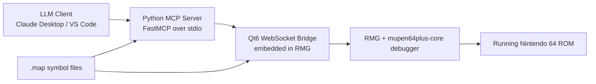

# RMG MCP Debug Bridge

A modified fork of **RMG (Rosalie's Mupen GUI)** with a built-in **Qt6 WebSocket bridge** and a companion **Python MCP server** for real-time Nintendo 64 reverse engineering.

This fork is designed for **decompilation and recompilation workflows**. It exposes emulator state to MCP-capable clients such as **Claude Desktop** and **VS Code**, allowing an LLM to inspect and control a live N64 session with symbol-aware debugging tools.

## Overview

This project extends upstream RMG with:

- a local JSON/WebSocket bridge embedded in the emulator
- direct RDRAM and VR4300 register inspection
- symbol loading from `.map` files
- breakpoints and watchpoints
- execution control primitives
- structured debug event capture
- JSONL trace export and comparison
- an MCP server that exposes all of the above as tools

## Architecture



## What This Fork Adds

### Emulator Bridge

The embedded bridge currently supports:

- RDRAM read and write
- MIPS register read and write
- CPU state snapshots
- virtual-to-physical address translation
- disassembly by address or symbol
- pause, resume, single-step, step over, and step out
- soft reset, hard reset, and full ROM restart
- breakpoints and watchpoints
- symbol loading, lookup, and resolution
- structured debug event polling
- filtered event streaming

### MCP Tools

The Python MCP server in [server.py](/D:/Proyectos/n64-mcp/RMG/server.py) currently exposes tools including:

- `read_rdram`, `write_rdram`
- `read_symbol`, `write_symbol`
- `read_mips_register`, `write_mips_register`
- `debugger_state`, `cpu_snapshot`
- `translate_address`
- `resolve_symbol_name`, `resolve_symbol`, `lookup_symbol`
- `disassemble_rdram`, `disassemble_symbol`
- `pause_emulation`, `resume_emulation`
- `reset_emulation`, `restart_rom`
- `step_instruction`, `step_over`, `step_out`
- `run_until_address`, `run_until_symbol`
- `add_breakpoint`, `add_watchpoint`
- `add_symbol_breakpoint`, `add_symbol_watchpoint`
- `remove_breakpoint`, `remove_symbol_breakpoint`, `remove_symbol_watchpoint`
- `list_breakpoints`, `clear_breakpoints`
- `load_symbols`, `clear_symbols`, `symbol_status`
- `get_debug_events`
- `capture_instruction_trace`
- `compare_trace_files`
- `bridge_status`

### Reverse Engineering Features

- symbol-addressed reads, writes, disassembly, breakpoints, and watchpoints
- watchpoint hit snapshots with registers and memory bytes
- filtered debug event streaming over WebSocket
- JSONL trace capture for offline analysis
- trace comparison for original-vs-recompiled behavior checks

## Repository Layout

```text
RMG/
├── README.md
├── server.py
├── Source/
│   ├── RMG/
│   │   └── MCP/
│   │       ├── McpBridgeServer.cpp
│   │       └── McpBridgeServer.hpp
│   └── RMG-Core/
│       ├── Debugger.cpp
│       ├── Debugger.hpp
│       └── m64p/
│           ├── DebuggerApi.cpp
│           └── DebuggerApi.hpp
└── Bin/
    └── Release/
```

The canonical implementation lives entirely inside this repository. Earlier standalone prototypes were removed to avoid drift.

## Build Requirements

### Runtime

- Windows 10/11
- Python 3.12+
- an MCP-capable client such as Claude Desktop or VS Code

### Build

- MSYS2 `ucrt64`
- CMake 3.15+
- Qt6 with `WebSockets`
- the normal dependencies required by upstream RMG

## Building This Fork

### Windows

Install the usual RMG prerequisites in MSYS2 `ucrt64`, then configure with the MCP bridge enabled:

```bash
cmake -S . -B build-mcp-ucrt -G "MSYS Makefiles" ^
  -DCMAKE_BUILD_TYPE=Release ^
  -DMCP_BRIDGE=ON ^
  -DPORTABLE_INSTALL=ON ^
  -DNETPLAY=OFF ^
  -DVRU=OFF ^
  -DUSE_ANGRYLION=OFF ^
  -DUPDATER=OFF
cmake --build build-mcp-ucrt --config Release -j 8
cmake --install build-mcp-ucrt
```

To bundle runtime dependencies:

```bash
cmake --build build-mcp-ucrt --target bundle_dependencies
```

When finished, the portable build is typically available under `Bin/Release`.

## Running the MCP Server

Install Python dependencies:

```bash
pip install mcp websockets
```

Then start the MCP server:

```bash
python server.py
```

Environment variables:

- `RMG_MCP_HOST` default: `127.0.0.1`
- `RMG_MCP_PORT` default: `8765`
- `RMG_MCP_TIMEOUT_SECONDS` default: `2.0`

## Quick Start

1. Build RMG with `MCP_BRIDGE=ON`.
2. Launch `RMG.exe`.
3. Load a ROM.
4. Start [server.py](/D:/Proyectos/n64-mcp/RMG/server.py).
5. Connect your MCP client over `stdio`.
6. Load a symbol map with `load_symbols`.
7. Start debugging by symbol, address, trace, or watchpoint.

## Example Workflows

### Read a Global by Symbol

```text
load_symbols("D:/symbols/game.map")
read_symbol("D_8010ADA0", 4)
```

### Stop at a Function

```text
run_until_symbol("thread3_main", offset_bytes=0xF4)
```

### Add a Watchpoint and Inspect the Hit

```text
add_symbol_watchpoint("D_8010ADA0", access="write", size_bytes=4)
resume_emulation()
get_debug_events(limit=16, event_types="debugger.watchpoint_hit")
```

### Capture and Compare Traces

```text
capture_instruction_trace(
  duration_ms=2000,
  output_path="trace_original.jsonl"
)

compare_trace_files(
  trace_a_path="trace_original.jsonl",
  trace_b_path="trace_recompiled.jsonl"
)
```

## MCP Client Integration

### Claude Desktop

Example `claude_desktop_config.json` entry:

```json
{
  "mcpServers": {
    "rmg-n64-debugger": {
      "command": "python",
      "args": ["D:/Proyectos/n64-mcp/RMG/server.py"],
      "env": {
        "RMG_MCP_HOST": "127.0.0.1",
        "RMG_MCP_PORT": "8765",
        "RMG_MCP_TIMEOUT_SECONDS": "5.0"
      }
    }
  }
}
```

### VS Code

Example `.vscode/mcp.json` entry:

```json
{
  "servers": {
    "rmgN64Debugger": {
      "type": "stdio",
      "command": "python",
      "args": ["D:/Proyectos/n64-mcp/RMG/server.py"],
      "env": {
        "RMG_MCP_HOST": "127.0.0.1",
        "RMG_MCP_PORT": "8765",
        "RMG_MCP_TIMEOUT_SECONDS": "5.0"
      }
    }
  }
}
```

## Upstream RMG

This repository is based on upstream RMG:

- [Rosalie241/RMG](https://github.com/Rosalie241/RMG)

RMG is a free and open-source `mupen64plus` front-end written in C++.

## Roadmap

- richer structured execution traces
- stronger original-vs-recompiled comparison workflows
- symbol-aware memory layout decoding for structs and arrays
- more function-level reverse engineering automation

## License

This fork follows the licensing terms of upstream RMG. See the repository license and upstream project for details.

Do not redistribute commercial ROMs or copyrighted game assets.
